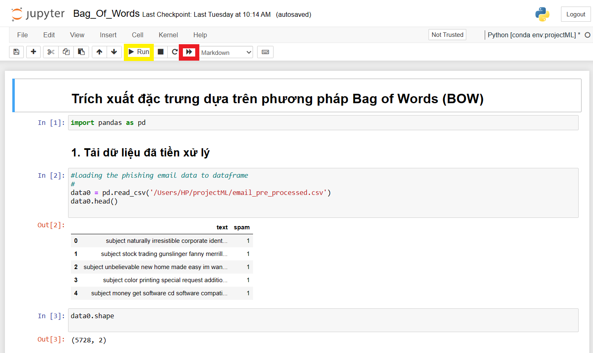

# ProjectML_HUST
## Các thư viện sử dụng
- Panda
- Numpy
- Matplotlib
- Pylab
- Sklearn
- Genism
- Nltk
- Re

## Thu thập dữ liệu
- Dataset được tải về ở đây: [https://www.kaggle.com/code/balakishan77/spam-or-ham-email-classification/input](https://www.kaggle.com/code/balakishan77/spam-or-ham-email-classification/input) Spam-or-Ham-Email-Classification | Kaggle
- Dataset gồm 4360 Email là Ham (tốt) và 1368 Emal là Spam (xấu). Tổng số lượng email là 5728.
- Dataset được lưu về trong thư mục “Data” của Folder “projectML”: emails.csv
- Sau khi tiền xử lý dữ liệu, xem qua Preprocessing.ipynb, nhóm dùng file được trích xuất ra là email_pre_processed.csv để tải dữ liệu lên xử lý.
- Các file còn lại trong thư mục liên quan đến việc cài đặt các phương pháp trích xuất đặc trưng được sử dụng.
  - Lưu ý: Khi tải dữ liệu để huấn luyện, cần thay đổi đường dẫn cho phù hợp

## Các phương pháp trích xuất đặc trưng
- Content-based
- Bag Of Words in terms of Frequency
- TF-IDF
- Word2vec

## Model dùng huấn luyện gồm
- Gaussian Naive Bayes 
- Support Vector Machine Classifier
- K-nearest Neighbor
- Random Forest

## Cách chạy code

- Sử dụng nút khoanh đỏ để chạy lại toàn bộ từ đầu
- Sử dụng nút khoanh vàng để chạy từng cell
